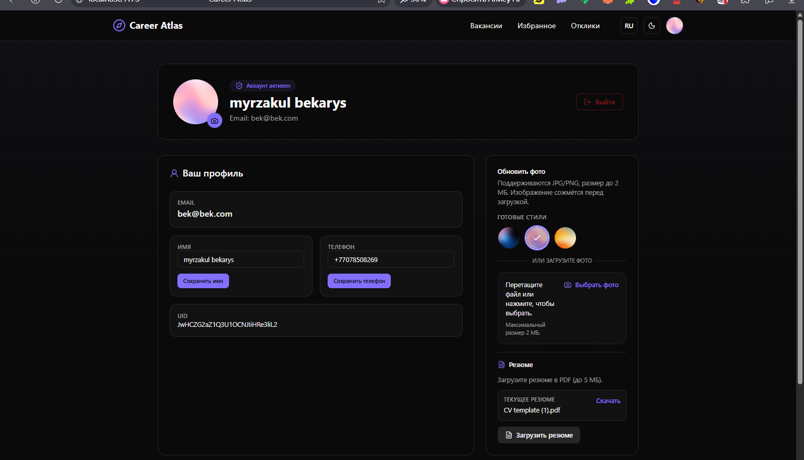
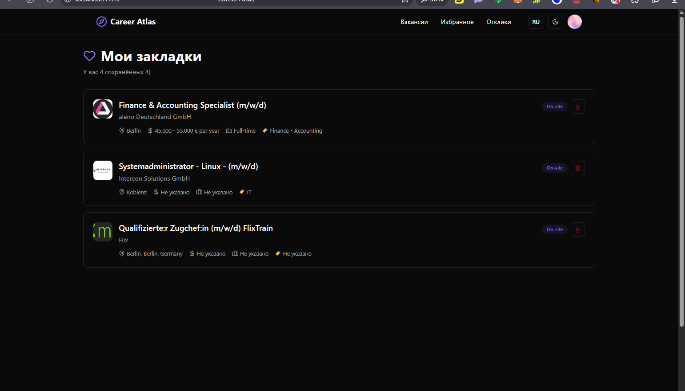
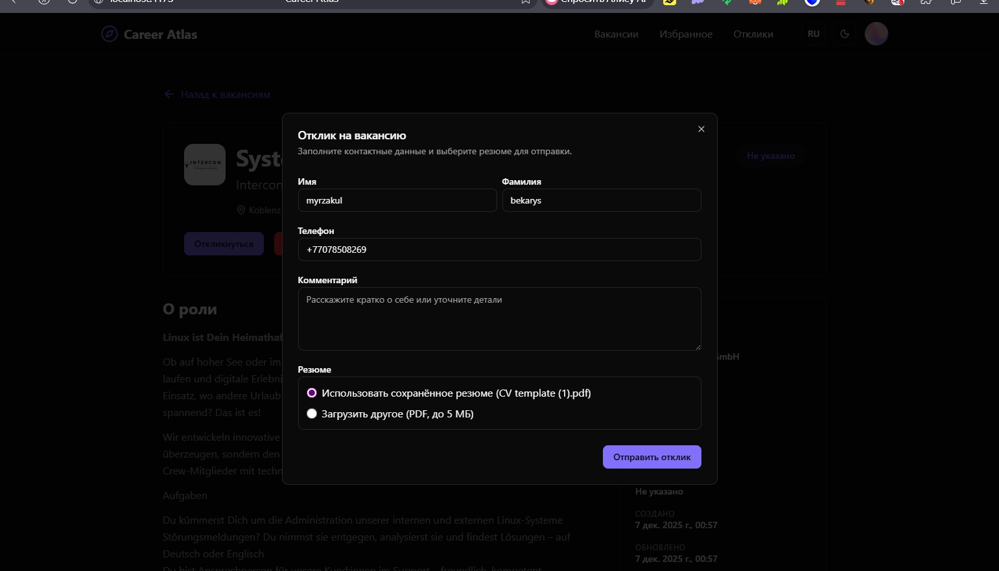
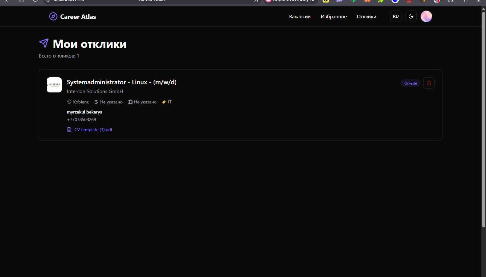
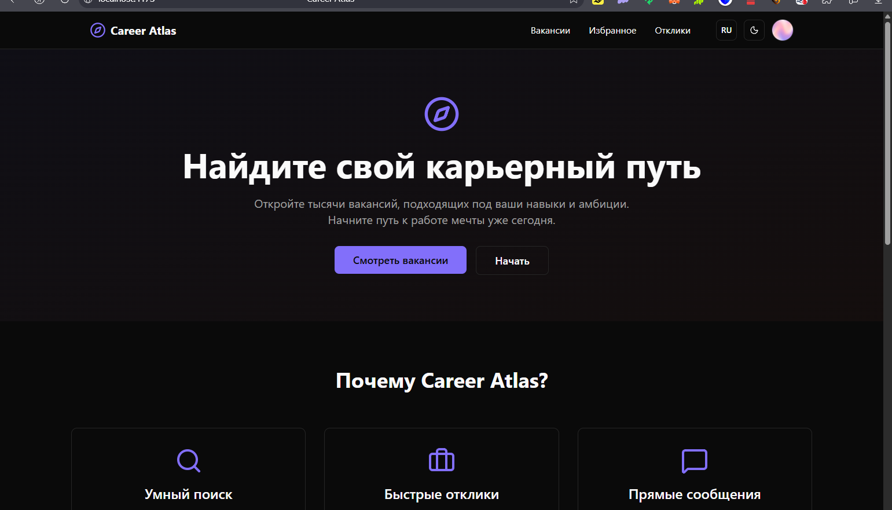
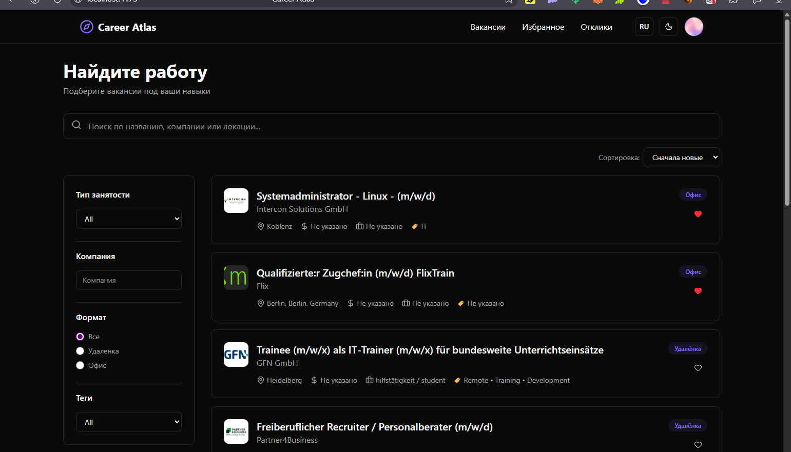

# Career Atlas

Карточка вакансий с авторизацией через Firebase, закладками, трекингом откликов и офлайн-режимом (PWA). Стек: Vite + React + TypeScript.

## Возможности
- Firebase Auth, Firestore, Storage.
- Избранное с мерджем локальных и серверных закладок при логине.
- Трекер откликов и профиль пользователя.
- PWA: кеширование shell, offline-страница и баннер.
- UI: Radix UI + shadcn/ui, тёмная/светлая тема, тосты Sonner.
- Маршрутизация React Router 7, состояние Redux Toolkit.

## Стек
- React 19, TypeScript, Vite 7
- Redux Toolkit, React Router
- Firebase (auth, firestore, storage)
- Radix UI + shadcn/ui, Tailwind v4, Sonner
- ESLint 9, TypeScript 5

## Быстрый старт
1) Установить зависимости:
```
npm install
```
2) Dev-режим:
```
npm run dev
```
3) Сборка:
```
npm run build
```
4) Превью сборки:
```
npm run preview
```
5) Линт:
```
npm run lint
```

## Конфигурация окружения
Firebase ключи заданы в `src/firebase.ts`. Замените на свои при необходимости. Offline-персистентность Firestore включена через `enableIndexedDbPersistence` (IndexedDB). Если браузер не даёт включить — будет предупреждение, работа продолжится онлайн.

## Структура
- `src/App.tsx` — маршруты и каркас.
- `src/pages/*` — страницы (главная, вакансии, детали, логин, регистрация, профиль, закладки, отклики, offline).
- `src/services/favoritesService.ts` — избранное (localStorage + Firestore, мердж).
- `src/context/AuthProvider.tsx` — контекст аутентификации.
- `src/store` — Redux store и слайсы.
- `public/service-worker.js` — сервис-воркер и кеширование.

## Как работает мердж избранного
- При логине берутся локальные IDs из `localStorage` и серверные из Firestore.
- Объединение через `new Set([...server, ...local])` без дублей.
- Если появились новые элементы — сохраняются в Firestore с `{ merge: true }`, локальное избранное очищается.

## PWA / Offline
- Сервис-воркер кеширует app shell и отдаёт `index.html` офлайн для маршрутов SPA, есть fallback `/offline`.
- Firebase/Google запросы не кешируются в SW, чтобы не мешать встроенному офлайн-кешу Firestore.
- API `http://88.218.170.214:8000` — стратегия network-first с кешом для GET.

## Скриншоты
- Главная: 
- Профиль: 
- Закладки: 
- Детали вакансии: 
- Отклики: 
- Поиск/фильтры: 

## Полезно
- Темы хранятся в `localStorage` (`vite-ui-theme`).
- Тосты: Sonner (`<Toaster />` подключён).
- Требуется Node.js 18+.

